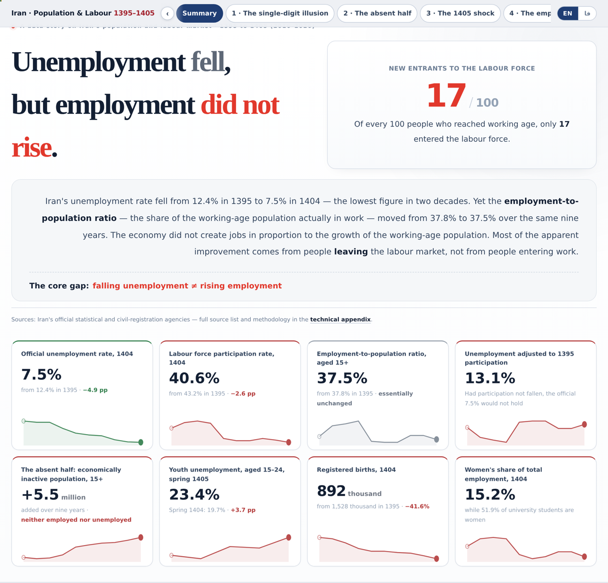

<div dir="rtl">

# جمعیت و نیروی انسانی ایران، ۱۳۹۵ تا ۱۴۰۵

**یک روایت تعاملی از یک توهم آماری: نرخ بیکاری ایران نصف شد، اما سهم شاغلان از جمعیت در سن کار اصلاً تکان نخورد.**

[](https://milad-shabani.github.io/iran-population-labour-dashboard/index.fa.html)
[](#ساخت)
[](LICENSE)

<p align="center"></p>

## یافتهٔ اصلی

نرخ بیکاری رسمی از **۱۲٫۴٪ در ۱۳۹۵** به **۷٫۵٪ در ۱۴۰۴** رسید؛ کم‌سابقه‌ترین رقم دو دههٔ اخیر. در همین نُه سال:

| | ۱۳۹۵ | ۱۴۰۴ | تغییر |
|---|---|---|---|
| جمعیت ۱۵ ساله و بیشتر | ۵۹٬۵۲۸ هزار | ۶۶٬۱۴۸ هزار | **۶٬۶۲۰+** |
| جمعیت فعال | ۲۵٬۷۲۳ هزار | ۲۶٬۸۳۷ هزار | ۱٬۱۱۴+ |
| شاغلان | ۲۲٬۵۲۵ هزار | ۲۴٬۸۲۲ هزار | ۲٬۲۹۷+ |
| **جمعیت غیرفعال** | ۳۳٬۸۰۵ هزار | ۳۹٬۳۱۱ هزار | **۵٬۵۰۶+** |
| نرخ مشارکت | ۴۳٫۲٪ | ۴۰٫۶٪ | ۲٫۶− واحد درصد |
| **نسبت اشتغال** | **۳۷٫۸٪** | **۳۷٫۵٪** | **۰٫۳− واحد درصد** |

از هر ۱۰۰ نفری که به سن کار رسیدند، تنها **۱۷ نفر** وارد بازار کار شدند. نرخ بیکاری کم شد چون مخرجِ کسر کوچک شد، نه چون اقتصاد به‌تناسب شغل ساخت.

## نرخ بیکاری تعدیل‌شده با مشارکت

شاخص محوری این اثر. یک پرسش خلاف‌واقع می‌پرسد: اگر نرخ مشارکت در سطح ۱۳۹۵ مانده بود، امروز نرخ بیکاری چقدر بود؟

تعداد شاغلان دست‌نخورده و دقیقاً همان رقم رسمی می‌ماند؛ فقط اندازهٔ جمعیت فعال بازمحاسبه می‌شود.

**نتیجه برای ۱۴۰۴: ۱۳٫۱٪ در برابر ۷٫۵٪ رسمی** — معادل **۱٫۷۴ میلیون بیکار پنهان**.

سال مبنا در داشبورد یک اهرم لغزنده است تا هر خواننده حساسیت نتیجه را خودش بسنجد. نکتهٔ مهم: جدایی دو خط از ۱۳۹۹ شروع می‌شود؛ بین ۱۳۹۶ تا ۱۳۹۸ بهبود واقعی بوده است.

## شغل‌های تازه از کجا آمدند؟

آمار رسمی ترکیب بخشی را فقط درصدی منتشر می‌کند و همین جهت تغییر را پنهان می‌کند. ضرب سهم در جمعیت شاغل هر سال:

| بخش | ۱۳۹۵ | ۱۴۰۴ | تغییر |
|---|---|---|---|
| کشاورزی | ۴٬۰۳۲ هزار | ۳٬۴۵۰ هزار | **۵۸۲−** |
| صنعت | ۷٬۱۸۶ هزار | ۸٬۱۴۲ هزار | ۹۵۶+ |
| خدمات | ۱۱٬۳۰۸ هزار | ۱۳٬۲۰۵ هزار | **۱٬۸۹۷+** |

کشاورزی نه‌تنها سهم، بلکه **شغل** از دست داده است. ۸۳٪ کل رشد خالص اشتغال از خدمات آمده.

## سایر یافته‌ها

- زنان ۵۱٫۹٪ دانشجویان‌اند و به‌برآورد این اثر **۱۵٫۲٪ شاغلان**. ۸۶٫۶٪ زنان ۱۵ ساله و بیشتر خارج از بازار کارند، در برابر ۳۲٫۱٪ مردان.
- بهار ۱۴۰۵ نخستین شکست روند است: ۴۵۱ هزار شغل کمتر از بهار ۱۴۰۴، که تقریباً همه‌اش از صنعت است.
- تولدها ۴۱٫۶٪ سقوط کرد؛ رشد طبیعی ۶۲٫۷٪ آب رفت و نسبت تولد به فوت از ۴٫۱ به ۱٫۹ رسید.
- کوهورت ورودی مدرسه ظرف یک دهه ۲۰٪ کوچک‌تر شده است.
- پیش‌بینی رسمی جمعیت در ۱۴۰۴ حدود ۱۶۹ هزار نفر از واقعیت جلو افتاده؛ شکاف انباشتهٔ از ۱۳۹۷ برابر ۳۱۹ هزار نفر است.

## پاک‌سازی داده

یک آزمون خودکار سازگاری روی همهٔ جدول‌های دارای ساختار «کل = اجزا» اجرا شد و **۹ ناسازگاری** پیدا کرد. ۵ مورد با شواهد داخلی اصلاح و ۴ مورد علامت‌گذاری شد. مهم‌ترین:

| مورد | منتشرشده | اصلاح‌شده | شاهد |
|---|---|---|---|
| تولد پسران، ۱۳۹۵ | ۷۶۶٬۱۴۲ | **۷۸۶٬۱۴۲** | شهری + روستایی = ۷۸۶٬۱۴۲؛ نسبت جنسی تولد را از ۱۰۳٫۳ به ۱۰۶٫۰ برمی‌گرداند که با ۱۰۶٫۱ در ۱۳۹۶ هم‌خوان است |
| فوت شهری، زمستان ۱۴۰۴ | ۹۰۸٬۸۶۶ | **۹۰٬۸۶۶** | یک رقم اضافه؛ رقم اصلاح‌شده جمع کل کشور را برقرار می‌کند |

شرح کامل هر ۹ مورد با مقدار اصلی، مقدار اصلاحی و دلیل، در پیوست فنی داشبورد آمده است.

## دو نسخه، یک پروژه

| فایل | زبان | جهت | پیوند زنده |
|---|---|---|---|
| [`index.fa.html`](index.fa.html) | **فارسی** | راست‌به‌چپ | [milad-shabani.github.io/…/index.fa.html](https://milad-shabani.github.io/iran-population-labour-dashboard/index.fa.html) |
| [`index.html`](index.html) | **English** | چپ‌به‌راست | [milad-shabani.github.io/…](https://milad-shabani.github.io/iran-population-labour-dashboard/) |

این دو، یک صفحه با لایهٔ ترجمه نیستند؛ دو فایل کاملاً مستقل و خودبسنده‌اند. هرکدام نسخهٔ خودش از دادهٔ پاک‌سازی‌شده، موتور نمودار خودش، و قواعد محلی خودش را دارد: ارقام فارسی در برابر لاتین، جداکنندهٔ اعشار و هزارگان، و جداسازهای جهت‌دار یونیکد تا اعداد علامت‌دار و درصدها در بستر راست‌به‌چپ جابه‌جا نشوند.

کلید تعویض زبان در نوار بالای هر دو صفحه هست. هیچ‌چیز در هیچ‌کدام کم نیست: همان ۱۸ نمودار، همان ارقام، همان پیوست فنی.

## محتوای مخزن

```
index.html                              داشبورد انگلیسی (خودبسنده)
index.fa.html                           داشبورد فارسی (خودبسنده)
README.md / README.fa.md                همین متن، به دو زبان
data/raw/iran-macro-indicators.xlsx     فایل اکسل خام و دست‌نخورده
data/iran-population-labour-clean.json  دادهٔ پاک‌سازی‌شده
data/iran-key-series.csv                سری‌های اصلی، با BOM برای اکسل
assets/                                 تصویر نمودارها
publish.bat                             اسکریپت انتشار و فعال‌سازی GitHub Pages
LICENSE                                 MIT
```

هر دو داشبورد **یک فایل HTML مستقل** هستند. کافی است در مرورگر باز شوند — بدون نصب، بدون سرور، بدون مرحلهٔ ساخت.

## ساخت

- **صفر وابستگی.** هر ۱۸ نمودار SVG دست‌ساز است. بدون D3، بدون Chart.js، بدون فریم‌ورک. فایل آفلاین کار می‌کند.
- **راست‌به‌چپ درست.** استفادهٔ سراسری از جداسازهای جهت‌دار یونیکد، تا علامت اعداد، درصدها و بازه‌های سال هیچ‌جا جابه‌جا نشوند.
- **تعاملی.** راهنمای کلیک‌پذیر برای پنهان‌کردن سری‌ها، سنجاق‌کردن مقدار، حالت‌های تحلیلی (مقدار / شاخص / تغییر سالانه)، مدل زندهٔ جمعیت با سه اهرم، پیمایش با صفحه‌کلید، و خروجی PNG برای هر نمودار.
- **آمادهٔ چاپ.** استایل چاپ اختصاصی با همان پالت روی صفحه، خروجی PDF هفده‌صفحه‌ای.

## منابع داده

همهٔ ارقام از شیت «جمعیت و نیروی انسانی» فایل «شاخص‌های کلان اقتصادی و اجتماعی کشور» است که در `data/raw/` منتشر شده. هیچ دادهٔ بیرونی افزوده نشده.

[مرکز آمار ایران](https://www.amar.org.ir/) · [سازمان ثبت احوال](https://www.sabteahval.ir/) · [وزارت آموزش و پرورش](https://www.medu.ir/) · [وزارت علوم](https://www.msrt.ir/)

## آنچه ادعا نمی‌کنیم

نرخ تعدیل‌شده یک **کران بالا** است، نه ادعایی دربارهٔ بیکاری واقعی. فرض می‌کند هر کسی که بازار کار را ترک کرده، اگر می‌ماند بیکار می‌بود — که قطعاً فرض سختگیرانه‌ای است. هدفش اندازه‌گیری بزرگی اثر است، نه جایگزینی آمار رسمی.

تفکیک جنسیتی اشتغال یک برآورد است، نه رقم منتشرشده. شکاف پیش‌بینی را می‌توان با مهاجرت خالص، فرض باروری یا هر دو توضیح داد؛ دادهٔ منبع اجازهٔ تفکیک نمی‌دهد.

## مجوز

کد و تحلیل: [MIT](LICENSE). آمار پایه متعلق به نهادهای رسمی نام‌برده است.

## نگارنده

**میلاد شعبانی** — مهندس هوش تجاری
[MiladShabani.ir](https://MiladShabani.ir) · [GitHub](https://github.com/Milad-Shabani) · [LinkedIn](https://linkedin.com/in/milad-shabani97)

</div>
