# Iran Population & Labour Market, 1395–1405 (2016–2026)

**An interactive data story about a statistical illusion: Iran's unemployment rate almost halved while the share of people actually working did not move at all.**

[](https://milad-shabani.github.io/iran-population-labour-dashboard/)
[](https://milad-shabani.github.io/iran-population-labour-dashboard/index.fa.html)
[](#how-it-is-built)
[](#the-charts)
[](LICENSE)

<p align="center"></p>

---

## Two editions, one project

| File | Language | Direction | Live link |
|---|---|---|---|
| [`index.html`](index.html) | **English** | LTR | [milad-shabani.github.io/iran-population-labour-dashboard](https://milad-shabani.github.io/iran-population-labour-dashboard/) |
| [`index.fa.html`](index.fa.html) | **Persian / فارسی** | RTL | […/index.fa.html](https://milad-shabani.github.io/iran-population-labour-dashboard/index.fa.html) |

The two are **not a translation layer over one page** — they are two fully independent, self-contained files. Each embeds its own copy of the cleaned dataset, its own chart engine, and its own locale rules: Latin versus Persian‑Indic numerals, decimal and thousands separators, and Unicode directional isolates so that signed numbers and percentages never reorder in right‑to‑left text.

A language switch in the top bar of both pages moves between them. Nothing is lost in either direction: the same 18 charts, the same figures, the same technical appendix.

Both open straight from disk. No build step, no server, no install, no internet required beyond an optional web font.

---

## A note on the calendar

All years are **Solar Hijri (Jalali)**, the Iranian civil calendar, because that is how the source data is published. Converting to Gregorian would misalign every figure, since an Iranian year runs from late March to late March.

| Iranian year | Gregorian span |
|---|---|
| 1395 | Mar 2016 – Mar 2017 |
| 1399 | Mar 2020 – Mar 2021 |
| 1404 | Mar 2025 – Mar 2026 |
| 1415 | Mar 2036 – Mar 2037 |

"Spring 1405" is the quarter beginning late March 2026 — the most recent data point in the set.

---

## The finding

Iran's official unemployment rate fell from **12.4% in 1395** to **7.5% in 1404**, the lowest in two decades. Over the same nine years:

| | 1395 | 1404 | Change |
|---|---:|---:|---:|
| Working-age population (15+) | 59,528k | 66,148k | **+6,620k** |
| Economically active | 25,723k | 26,837k | +1,114k |
| Employed | 22,525k | 24,822k | +2,297k |
| **Economically inactive** | 33,805k | 39,311k | **+5,506k** |
| Participation rate | 43.2% | 40.6% | −2.6 pp |
| **Employment-to-population ratio** | **37.8%** | **37.5%** | **−0.3 pp** |

Only **17 of every 100** people who reached working age entered the labour force. The unemployment rate fell because the denominator shrank.

<p align="center">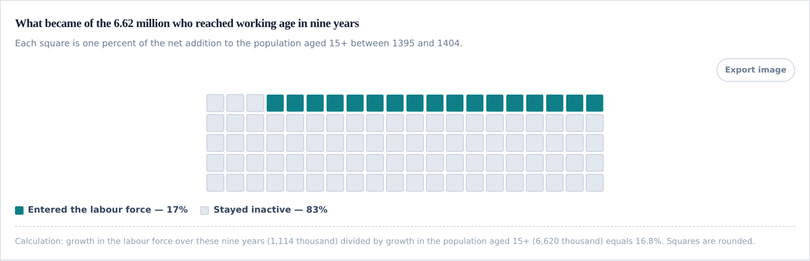</p>

### Definitions, so the argument is checkable

These three ratios are easy to confuse, and the whole analysis turns on the difference between them.

| Term | Definition | Why it matters here |
|---|---|---|
| **Unemployment rate** | unemployed ÷ **labour force** | Denominator is only people working *or actively seeking work*. Anyone who stops searching leaves the denominator and the rate falls — with no job created. |
| **Participation rate** | labour force ÷ **population 15+** | Measures how much of the working-age population is engaged with the labour market at all. Fell 2.6 pp. |
| **Employment-to-population ratio** | employed ÷ **population 15+** | Denominator is the whole working-age population, so it cannot be flattered by people dropping out. This is the honest measure, and it did not move. |
| **Economically inactive** | population 15+ minus labour force | Neither employed nor unemployed. Grew by 5.5 million. |
| **pp (percentage point)** | arithmetic difference between two rates | 12.4% → 7.5% is **−4.9 pp**, which is a **−39.5%** relative change. The dashboard always says "pp" where it means points. |

---

## The charts

Eighteen charts, all hand-built SVG. A selection:

### 1 · Official versus participation-adjusted unemployment

The project's headline derived indicator. It asks one counterfactual: *if the participation rate had stayed at its 1395 level, what would the unemployment rate be today?*

```
A*t = Pt × r_base            hypothetical labour force
U*t = (A*t − Et) / A*t       hypothetical unemployment rate
```

Employment counts stay exactly as published; only the size of the labour force is recomputed.

**1404: 13.1% adjusted, against 7.5% official** — a gap of **1.74 million hidden unemployed**.

<p align="center">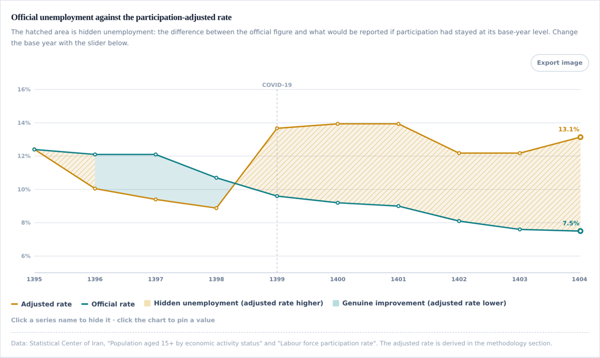</p>

The hatched wedge is the gap. Note that it only opens from 1399: between 1396 and 1398 the improvement was genuine, and the dashboard says so. The base year is a slider, so any reader can test how sensitive the result is to that assumption.

### 2 · The same pattern in four independent groups

If the fall in unemployment were real, different groups would show different patterns. Instead men, women, urban and rural all repeat the same thing: the unemployment line falls and the participation line falls with it.

<p align="center">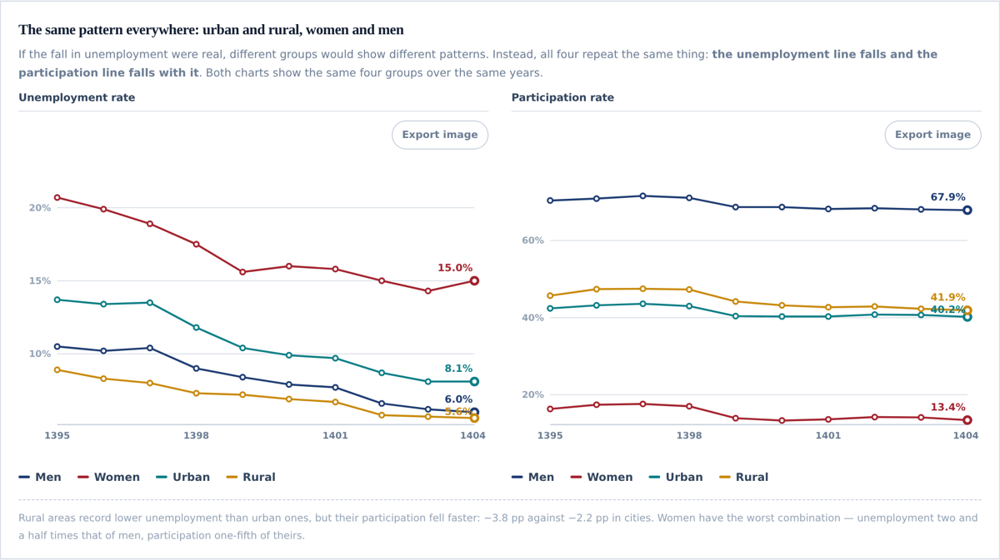</p>

One occurrence could be coincidence. Four independent repetitions make it structural.

### 3 · Share versus headcount — where the jobs actually came from

Official statistics publish sector composition only as *percentages*, which hides the direction of change. Agriculture's share fell — but did it lose jobs, or just grow more slowly? The chart has a toggle; the answer is unambiguous.

| | Share view | Headcount view |
|---|---|---|
| | 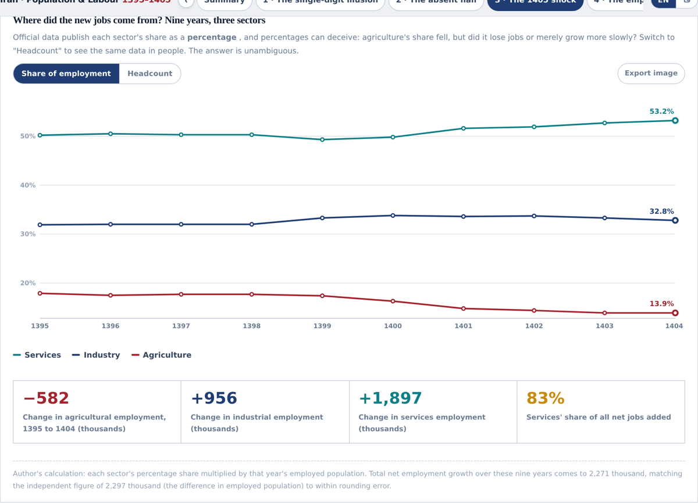 | 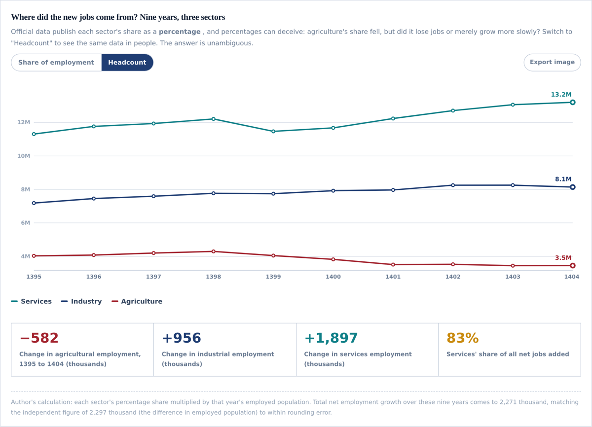 |

| Sector | 1395 | 1404 | Change |
|---|---:|---:|---:|
| Agriculture | 4,032k | 3,450k | **−582k** |
| Industry | 7,186k | 8,142k | +956k |
| Services | 11,308k | 13,205k | **+1,897k** |

Agriculture did not merely lose share; it lost jobs. **83% of all net employment growth came from services.** The totals reconcile: 2,271k summed across sectors against 2,297k from the independent employment series — inside rounding error.

### 4 · The human-capital scissors

Women are **51.9% of university students** and an estimated **15.2% of the employed**. The two lines move in opposite directions.

<p align="center">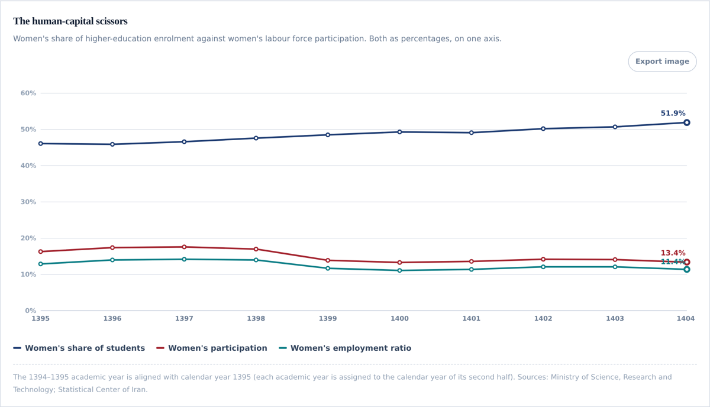</p>

<p align="center">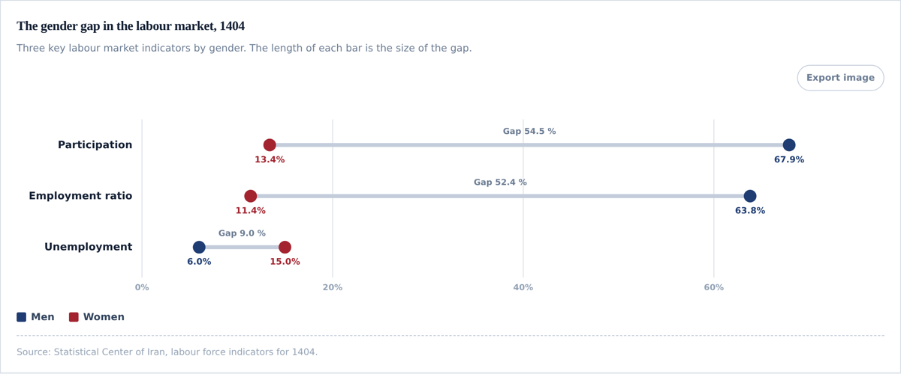</p>

86.6% of women aged 15+ are outside the labour force, against 32.1% of men. That is **28.7 million women** — a pool larger than everyone currently employed in Iran.

### 5 · Births and deaths on a collision course

<p align="center">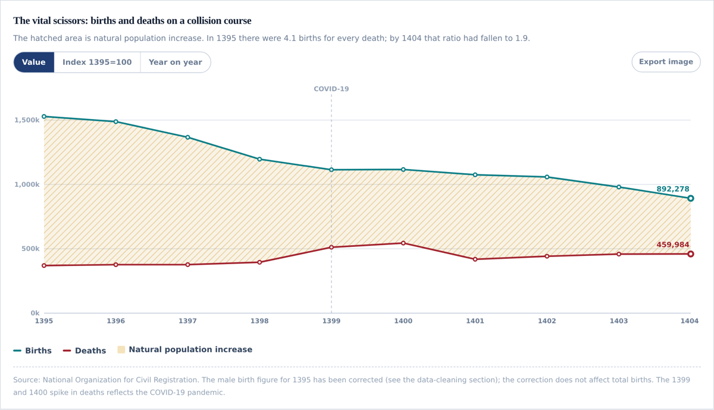</p>

Births fell **41.6%** (1,528,053 → 892,278). Deaths rose 24.4%. Natural increase collapsed **62.7%**, and the birth-to-death ratio went from 4.1 to 1.9. Marriages fell 38.7% while divorces stayed flat, at 42 per 100 marriages — and marriages lead births by about a year (r = 0.95), so the decline is already locked into the data.

### 6 · Cohorts already born

<p align="center">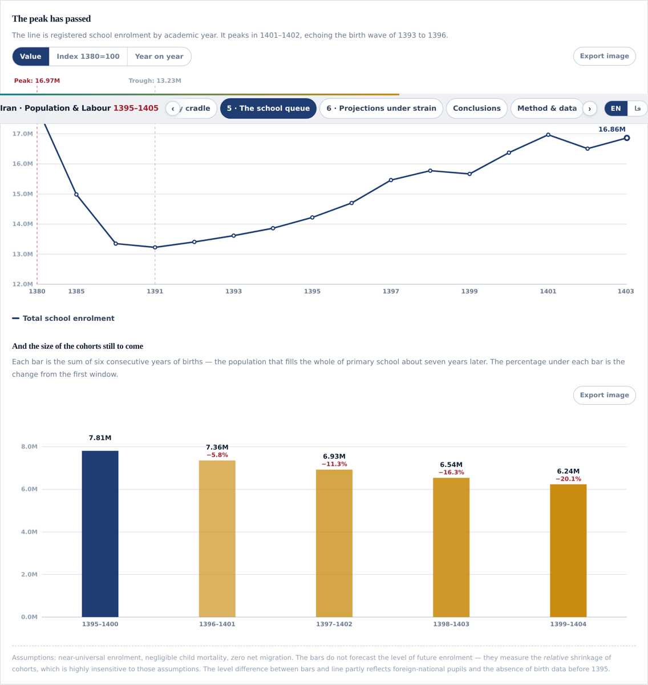</p>

The rare part of demography that needs no assumptions: the children are already born. Each bar is six consecutive years of births — the population that fills primary school seven years later. The newest cohort is **20.1% smaller** than the 1395–1400 one.

### 7 · Official projections running ahead of reality

<p align="center">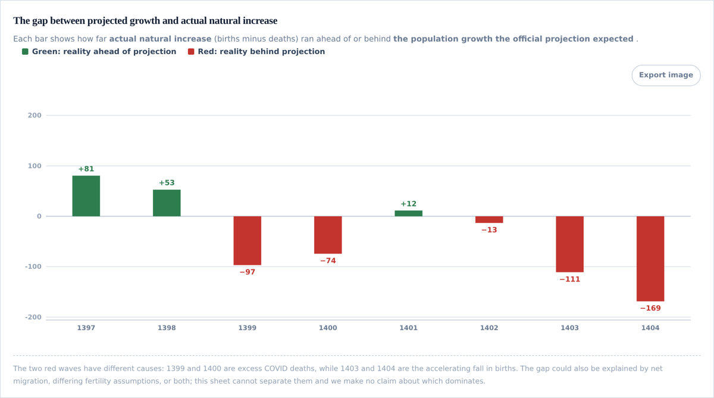</p>

Green means reality came in ahead of the projection; red means it fell behind. The two red waves have different causes — 1399–1400 is excess COVID mortality, 1403–1404 is the accelerating fall in births. The 1404 shortfall alone is **169 thousand**, and the gap has more than doubled in two years.

### 8 · A live population model you can argue with

<p align="center">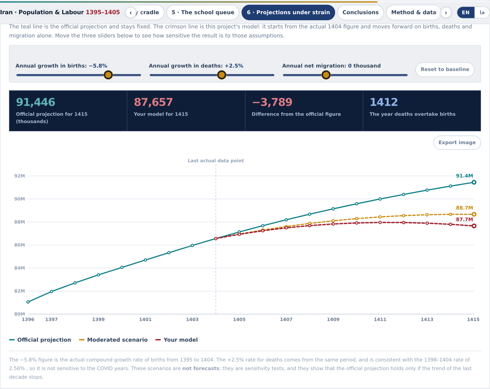</p>

Rather than asserting a forecast, the dashboard hands the assumptions over. Three sliders — annual growth in births, annual growth in deaths, net migration — drive a model that starts from the actual 1404 population. Four readouts update live, including the year deaths overtake births.

At the baseline (births −5.8%/yr, the actual compound rate) the crossover is **1412** and 1415 lands at 87.7 million against the official 91.4 million. Soften the birth decline to −2.0% and the crossover moves past 1415. The point is the sensitivity, not any single number.

---

## Data corrections

An automated consistency test was run over every table in the source sheet with a `total = sum of parts` structure. It flagged **nine inconsistencies**. Five were corrected on conclusive internal evidence; four were flagged and left untouched. All nine are documented in the dashboard's appendix with original value, corrected value and proof.

| # | Field | Published | Corrected | Evidence |
|---|---|---:|---:|---|
| 1 | Male births, 1395 | 766,142 | **786,142** | Urban + rural males = 786,142. Also moves the sex ratio at birth from an implausible 103.3 to 106.0, matching 106.1 in 1396. |
| 2 | Rural births total, 1396 | 344,355 | **344,365** | Male + female = 344,365. |
| 3 | Urban deaths, winter 1404 | 908,866 | **90,866** | One extra digit — the published value is eight times the entire quarter's deaths. |
| 4 | Rural deaths, winter 1404 | 23,805 | **22,805** | Male + female = 22,805; the quarter then totals exactly. |
| 5 | Rural deaths, summer 1404 | 25,531 | **23,531** | Male + female = 23,531. |

Flagged but **not** altered: the 1395 male/female death columns appear transposed (M/F ratio 0.78 against 1.20–1.30 in every later year, inverted simultaneously in the national, urban and rural rows); the 1395 figure for 18–35 unemployment is a definitional break and is excluded from trend analysis; unknown-sex residuals in death totals (<0.03%, zero from 1402); ±1k rounding in the projection.

**No correction touches a national total.** All five are internal components.

---

## What is in this repository

```
.
├── index.html                              English dashboard  (self-contained)
├── index.fa.html                           Persian dashboard  (self-contained)
├── README.md / README.fa.md                this file, in both languages
├── data/
│   ├── raw/iran-macro-indicators.xlsx      source workbook, unmodified
│   ├── iran-population-labour-clean.json   cleaned dataset the dashboards run on
│   └── iran-key-series.csv                 tidy key series, UTF-8 BOM for Excel
├── assets/                                 chart screenshots used above
└── LICENSE                                 MIT
```

The cleaned dataset is embedded in each HTML file and can also be downloaded from inside the page, so every figure is auditable without cloning anything.

## How it is built

- **Zero runtime dependencies.** All 18 charts are hand-rolled SVG. No D3, no Chart.js, no framework, no bundler. Each file works offline.
- **Right-to-left done properly.** The Persian edition uses Unicode directional isolates throughout, so signed numbers, percentages and year ranges never reorder — the failure mode most RTL dashboards ship with.
- **Interactive throughout.** Clickable legends that hide series and rescale the axis; click-to-pin tooltips for comparing two points; analytical mode switches (value / index / year-on-year); the live population model; keyboard navigation with arrow keys; per-chart PNG export.
- **Print-aware.** A dedicated print stylesheet produces a clean 17-page PDF with the on-screen palette intact.
- **Reproducible.** Every derived figure appears in the appendix with its formula and inputs, cross-validated against an independent series where one exists. The gender decomposition, for instance, reconstructs the labour force to within 0.002% of the published value.

## Data sources

All figures come from the "Population and Human Resources" sheet of the *Macroeconomic and Social Indicators of Iran* workbook, included unmodified in [`data/raw/`](data/raw/). No external data was added.

- [Statistical Center of Iran](https://www.amar.org.ir/) — population projection to 1415, household size, Labour Force Survey
- [National Organization for Civil Registration](https://www.sabteahval.ir/) — births, deaths, marriages, divorces
- [Ministry of Education](https://www.medu.ir/) — school enrolment
- [Ministry of Science, Research and Technology](https://www.msrt.ir/) — higher education enrolment and graduates

## What this project does not claim

The participation-adjusted rate is an **upper bound**, not a claim about true unemployment. It assumes everyone who left the labour force would have been unemployed had they stayed, which is certainly too strong. Its purpose is to size the effect, not to replace the official statistic — and the official statistic itself follows the ILO standard and is not disputed here.

The gender decomposition of employment is an estimate derived from published ratios, not a published figure. The projection gap could be explained by net migration, fertility assumptions, or both; the source data cannot separate them. The spring 1405 finding rests on a single quarter and needs confirmation. No causal claim is made anywhere; the marriage–birth correlation is a time-lagged association.

## Licence

Code and analysis: [MIT](LICENSE). The underlying statistics are published by the Iranian government agencies listed above and remain subject to their terms.

## Author

**Milad Shabani** — Business Intelligence Engineer
[MiladShabani.ir](https://MiladShabani.ir) · [GitHub](https://github.com/Milad-Shabani) · [LinkedIn](https://linkedin.com/in/milad-shabani97)
